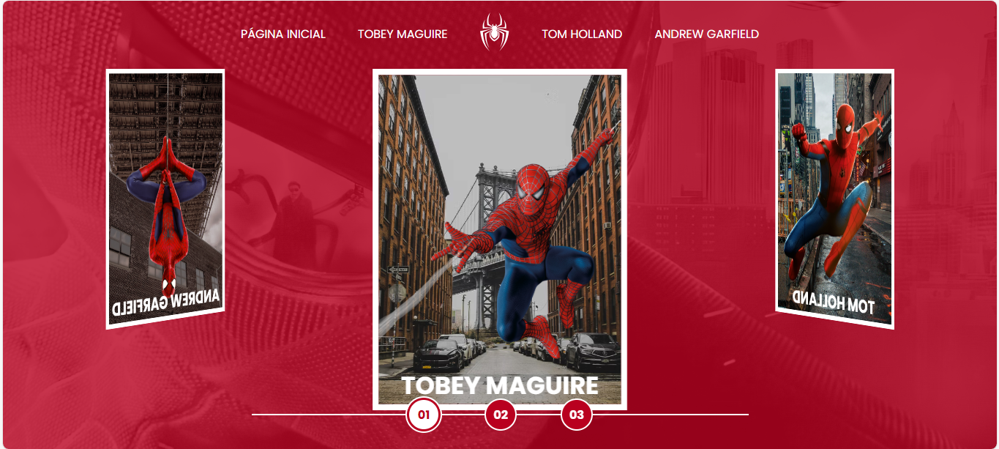

# 🕷️ Spider-Man | Multiversos - Projeto Web Interativo

**Explore o incrível multiverso do Homem-Aranha** através deste projeto web interativo que homenageia as diferentes versões do icônico herói da Marvel. Explore as diferentes faces do Homem-Aranha em um carrossel 3D imersivo!

## 🚀 Visão Geral
Uma experiência web interativa que celebra as três icônicas versões cinematográficas do Homem-Aranha (Tobey Maguire, Andrew Garfield e Tom Holland), mergulhando no conceito de multiverso com efeitos visuais dinâmicos e design responsivo.

## ✨ Recursos Principais

- **Carrossel 3D interativo** com os três principais atores que interpretaram o Homem-Aranha
- **Design responsivo** que se adapta a diferentes tamanhos de tela
- **Efeitos visuais dinâmicos** com hover e transições suaves
- **Páginas individuais** para cada versão do personagem
- **Galeria de imagens** com cenas marcantes dos filmes
- **Trailers integrados** das trilogias cinematográficas

## 🛠️ Tecnologias Utilizadas

- HTML5 semântico
- CSS3 moderno (Flexbox, Grid, transformações 3D)
- JavaScript puro (DOM manipulation, event listeners)
- Design System próprio com convenção BEM CSS
- Vídeos em background para imersão

## 🎯 Objetivo

Este projeto foi desenvolvido para demonstrar técnicas avançadas de front-end, criando uma experiência interativa que une fãs do Homem-Aranha e entusiastas de desenvolvimento web.

---

## 📌 **Próximas Atualizações**  
- [ ] Adicionar modo escuro/claro  
- [ ] Incluir seção de curiosidades sobre os filmes  
- [ ] Implementar efeitos sonoros temáticos  

---

## 💡 **Como Contribuir**  
1. Faça um **fork** do repositório  
2. Crie uma branch: `git checkout -b minha-feature`  
3. Envie suas alterações: `git push origin minha-feature`  
4. Abra um **Pull Request**  

---

**🎮 "Com grandes poderes, vem grandes responsabilidades"**  
Uma homenagem interativa ao legado do Homem-Aranha no cinema.  

--- 

**🔝 *"Seja amigável como o Homem-Aranha!"* 🕸️** 
